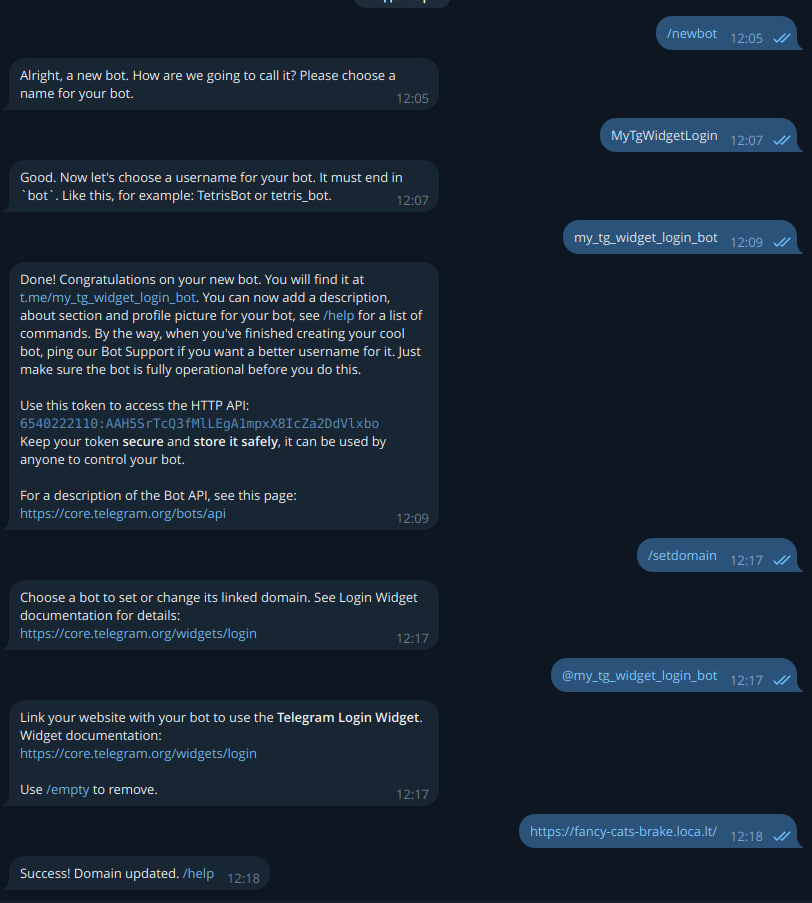

# streamlit-telegram-login

Streamlit Telegram Login Widget is a component for Streamlit that implements the [Telegram Login Widget](https://core.telegram.org/widgets/login)

This widget is a simple method of authorizing users on your website via Telegram.

## Purpose
The Telegram Login Widget is utilized for authorizing users on your website. After successful authorization, the widget can return user data in two ways:

- ~~By redirecting the user to a URL specified in the data-auth-url attribute with the following parameters: id, first_name, last_name, username, photo_url, auth_date, and hash~~. __Not implemented__
- By calling the data-onauth callback function with a JSON object containing the fields `id`, `first_name`, `username`, `photo_url`, `auth_date`, `hash`.

## Installation instructions 

```sh
$ pip install streamlit-telegram-login
```

## Usage instructions

```python
import streamlit as st

from streamlit_telegram_login import TelegramLoginWidgetComponent

telegram_login = TelegramLoginWidgetComponent(bot_username="Your bot username", secret_key="SecretKey")
value = telegram_login.button
st.write(value)
```

A list of all parameters that TelegramLoginWidgetComponent accepts. You can use them to customize the component.
The default value is shown in brackets:
- `bot_username`: str - Username of the Telegram bot. __required__
- `secret_key`: str - Secret key for JWT encode/decode. __required__
- `button_style`: str - Style of the login button (large, medium, small). [large]
- `userpic`: bool - Whether to show user profile picture. [True]
- `corner_radius`: Optional[int] - Corner radius of the button or None for default [None]
- `request_access`: bool - Whether to request account access [True]
- `expiry_days`: float - Cookie expiry days [30]
- `cookie_key`: str - Key to use for cookie storage [init]

For easy configuration of the widget you can also use YamlConfig to customize it
```python
from streamlit_telegram_login import TelegramLoginWidgetComponent
from streamlit_telegram_login.helpers import YamlConfig

config = YamlConfig("/path_to_file/file_config.yaml")
telegram_login = TelegramLoginWidgetComponent(**config.config)
...
```
YamlConfig validates the file and if all is well, saves the configuration to the `config` attribute. Therefore your file "file_config.yaml" must be in the correct format.

Here is an example of the correct configuration file format: [config.yaml](streamlit_telegram_login/config.yaml).

Here is a more detailed example of how to use the component: [example.py](examples/example.py)

## ATTENTION!
For Telegram Login Widget to work, you need to specify the domain on which the widget will work.
If the domain is not set, you will get an error:
 
 `Bot domain invalid`
 
 ###Registering a Domain Name
As stated in Telegram's official documentation, your website needs a Telegram bot that will handle user authorization requests. It must be tied to your site through a domain address.
1. If you already have a Telegram bot, the following is required:
    - In the Telegram bot [@BotFather](https://t.me/BotFather) run the command `/setdomain`.
    - Select your bot from the list, if there are several of them.
    - Specify the address of your domain. Localhost will not work. But there is still a way for local development, I will write about it below.
2. If you don't have your own Telegram bot yet, you need to follow these steps:
    - In Telegram bot [@BotFather](https://t.me/BotFather) run the command `/newbot`.
    - Specify a name for your bot that you would like. For the example I will specify here MyTgWidgetLogin
    - Next you need to specify the username for your bot. It must end in `bot`. In my example I will specify my_tg_widget_login_bot
    - After this step, do the steps in step 1 of this tutorial.
    


###localtunnel for local development and debugging

Telegram requires a domain name for your website because it will make requests to your site, transfer user data. So you need a tunnel - a website on the network that will forward all requests to your localhost.

Install the localtunnel package using npm (make sure you have it installed).
```sh
$ npm install -g localtunnel
```
Run localtunnel on the port on which you will be bringing up your streamlit server
```sh
$ lt --port 8501
```
After running it, we will get a link like this:

``your url is: https://fancy-cats-brake.loca.lt``

Start your streamlit server
```sh 
$ streamlit run streamlit_telegram_login/examples/example.py
``` 
The first time you try to access the link of the address given by localtunnel, you will be taken to the `Friendly Reminder` page where you need to perform the operations specified on this page.
If you have done everything correctly, you will be taken to your streamlit application page. The first launch may take some time, don't be alarmed.

## Planned for implementation:
The first thing I'll do is add a check for authorization data that came from the widget. [Here](https://core.telegram.org/widgets/login#checking-authorization) details. At the moment there is no data validation. 